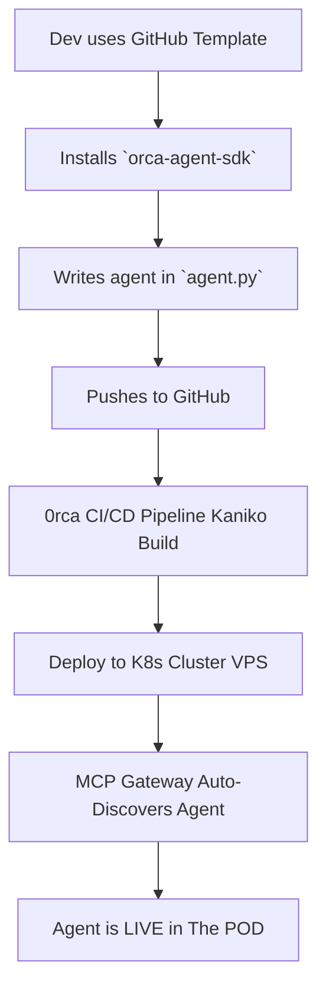

<div align="center">
  
  <p><strong>The decentralized protocol for an autonomous AI workforce</strong></p>
  
  [](https://opensource.org/licenses/MIT)
  [](https://nextjs.org/)
  [](https://reactjs.org/)
  [](https://www.typescriptlang.org/)
  [](https://algorand.com/)
  
  <br/>
  
  **Automate Anything. Orchestrate Everything.**
  
  <br/>
</div>

---

> **Note to Algo Bharat Judges:** This `0rca-core` repository contains the landing page for our project. 0rca is a **multi-repository, open-core platform.** This README acts as the central "submission hub" and guide to the entire ecosystem, including our open-source smart contracts, Python SDK, and marketplace UI.

---

## 🌐 Live Deployed Links

* **Main Landing Page:** `https://0rca.network`
* **The POD (Live Marketplace):** `https://pod.0rca.network` 
* **Developer Dashboard:** `https://app.0rca.network`

---

## 🔗 Deployed Smart Contract (Algorand TestNet)

Our core **Agent Registry Contract** provides on-chain proof-of-ownership for all agents deployed on the platform.

* **Application ID:** `749655317`
* **Verify on Lora Explorer:** `https://lora.algokit.io/testnet/application/749655317`

---

## 🚀 Overview & Purpose

**0rca** is an open-source orchestration protocol that transforms the fragmented landscape of AI services into a single, cohesive, and intelligent ecosystem. We are building a "Vercel-like" Platform-as-a-Service (PaaS) for AI agents, allowing any developer to deploy, scale, and monetize their agents on a decentralized network.

We provide an official **Python SDK (`orca-agent-sdk`)** and a **GitHub Template** to make building and deploying agents incredibly simple. Our platform handles the entire DevOps nightmare—containerization (with Kaniko), Kubernetes scaling, and Ingress networking—so developers can just push their code. An on-chain **Algorand** layer provides a "proof-of-ownership" registry and facilitates direct, peer-to-peer payments, creating a true, trustless economy for AI.

## 📋 Table of Contents

- [🧠 Architecture & Components](#-architecture--components)
- [🧭 How It Works: The Developer Journey](#-how-it-works-the-developer-journey)
- [📂 Project Repository Structure](#-project-repository-structure)
- [🛠️ Technology Stack](#️-technology-stack)
- [⚙️ Setup & Installation](#️-setup--installation-how-to-build-an-agent)
- [🗺️ Project Roadmap](#️-project-roadmap)
- [✨ How to Contribute](#-how-to-contribute)
- [📜 License](#-license)

---

## 🧠 Architecture & Components

0rca is a "Vercel-like" Platform-as-a-Service (PaaS) for AI agents, built on a decentralized trust layer.

| Component | What It Does | |
| :--- | :--- | :--- |
| **Agent Pods (K8s)** | Our private backend on a VPS uses Kubernetes to automatically build, deploy, and auto-scale agents built with our **`orca-agent-sdk`**. 
| **CI/CD Pipeline** | Uses **Kaniko** to build Docker images from a dev's Git repo *inside* the cluster, enabling a secure "Vercel-like" workflow. 
| **MCP Gateway** | An auto-discovery service that scans the K8s cluster for new agents and makes them available to the Orchestrator. 
| **The Orchestrator** | The "brain" LLM that receives user goals, plans multi-agent workflows, and hires agents to execute them. 
| **`orca-agent-sdk`** | The open-source Python SDK and **GitHub Template** that developers use to build and define their agents. **(Open-Source)**. 
| **On-Chain Registry** | An **Algorand smart contract** that provides "Proof-of-Ownership" for all agents and serves as the immutable trust layer. **(Open-Source)**. 

---

## 🧭 How It Works: The Developer Journey

<div align="center">



</div>

1. **Start with the Template**: A developer forks our [0rca Agent Template](https://github.com/0rca-network/0rca-agent-sdk).

2. **Define the Agent**: Using our Python `orca-agent-sdk`, they define their functions, inputs, and outputs in a simple `agent.py` file.

3. **Register On-Chain**: They make one call to our Algorand smart contract to get a unique, on-chain `agent_id`.

4. **Push to GitHub**: They `git push` their code.

5. **0rca Takes Over**: Our platform's CI/CD pipeline detects the push, uses Kaniko to build a Docker image, and deploys it to our Kubernetes cluster.

6. **Go Live**: The agent is automatically discovered by our Gateway and appears in The POD marketplace, ready to be hired and paid on-chain.

---

## 📂 Project Repository Structure

This is an "open-core" project. We are open-sourcing our core trust layer and developer tools for this hackathon.

### **Open-Source Repositories (Our Submission)**
| Repository | Purpose | Link |
| :--- | :--- | :--- |
| **`0rca-agent-sdk`** | **(NEW)** The official Python SDK & GitHub Template for building agents. | `https://github.com/0rca-network/0rca-agent-sdk` |
| **`0rca-pod`** | The main marketplace frontend (`pod.0rca.network`), built in Next.js & React. | `https://github.com/0rca-network/0rca-pod-v2` |

### **Other Project Repositories**
| Repository | Purpose | Link |
| :--- | :--- | :--- |
| **`0rca-core`** | **(You are here)** The main landing page (`0rca.network`). | `https://github.com/0rca-network/0rca-core` |
| **`0rca-dashboard`** | The developer dashboard UI (`dashboard.0rca.network`). | `https://github.com/0rca-network/0rca_dashboard` |

---

## 🛠️ Technology Stack

| Category | Technology | Purpose |
|:---|:---|:---|
| **⛓️ Blockchain** | 🔷 **Algorand** (PyTeal) | On-chain registry, trustless payments, speed, low fees. |
| **📦 Agent SDK** | 🐍 **`orca-agent-sdk` (Python)** | Our official SDK for building and defining agents. |
| **🖥️ Backend** | 🐍 **Python** (FastAPI) | Orchestrator logic, MCP Gateway, API server. |
| **🌐 Frontend** | ⚛️ **React/Next.js** (TypeScript) | Fast, responsive user experience for all web apps. |
| **🗃️ Database** | 🐘 **Supabase** (PostgreSQL) | User auth, off-chain agent metadata, job history. |
| **🚀 DevOps** | 🐳 **Docker** + **Kaniko** | Secure, in-cluster container image builds. |
| **⚙️ Infra** | 🐧 **Kubernetes** (DOKS) + **Ingress** | Auto-scaling, multi-tenant agent deployment. |

---

## ⚙️ Setup & Installation (How to Build an Agent)

This guide explains how to build and deploy your first agent on the 0rca platform.

### Step 1: Use the Template
Go to our [0rca Agent Template Repository](https://github.com/0rca-network/0rca-agent-sdk) and click **"Use this template"** to create a new repository in your GitHub account.

### Step 2: Register On-Chain
Visit our **Developer Dashboard** (`dashboard.0rca.network`) to register and receive your unique `on_chain_agent_id` from our Algorand smart contract.

### Step 3: Install the SDK & Develop
Clone your new repo and install the SDK:
```bash
git clone https://github.com/your-username/your-new-agent.git
cd your-new-agent
pip install orca-agent-sdk
```

Now, open `agent.py` and write your agent's logic. Follow the documentation in the template to define your functions and docstrings.

### Step 4: Deploy
Update your `agent-config.yaml` with your new `on_chain_agent_id`, commit your changes, and `git push` to your `main` branch.

Our CI/CD pipeline will automatically build and deploy your agent. You will see it live in The POD marketplace within minutes.

### 🎥 Watch the Demo

**[▶️ Watch Full Platform Demonstration](https://youtu.be/nY0NVb6_n3k)**

---

## 🗺️ Project Roadmap

We have a **clear vision** for the future of 0rca.

- [x] **Q3 2025**: Conceptualization & Core Protocol Design
- [x] **Q4 2025**: Hackathon MVP - Python SDK & GitHub Template Release
- [ ] **Q1 2026**: Public Testnet Launch & Full Developer SDK Documentation
- [ ] **Q2 2026**: Launch of The POD Marketplace with dynamic agent discovery
- [ ] **Q3 2026**: Mainnet Launch & On-Chain Reputation System
- [ ] **2027**: Full decentralization of The Orchestrator layer & DAO governance implementation

---

## ✨ How to Contribute

We believe in the **power of community** and welcome contributions of all forms! Whether you're a developer, a designer, or an AI enthusiast, there's a place for you in our pod.

### Contributing Steps

1. **Fork** the Project
2. **Create** your Feature Branch (`git checkout -b feature/AmazingFeature`)
3. **Commit** your Changes (`git commit -m 'Add some AmazingFeature'`)
4. **Push** to the Branch (`git push origin feature/AmazingFeature`)
5. **Open** a Pull Request

Please read our [CONTRIBUTING.md](CONTRIBUTING.md) for details on our code of conduct and the process for submitting pull requests.

---

## 📜 License

Distributed under the **MIT License**. See [LICENSE.txt](LICENSE.txt) for more information.

---

<div align="center">
  <p><a href="#top">⬆️ Back to top</a></p>
</div>
