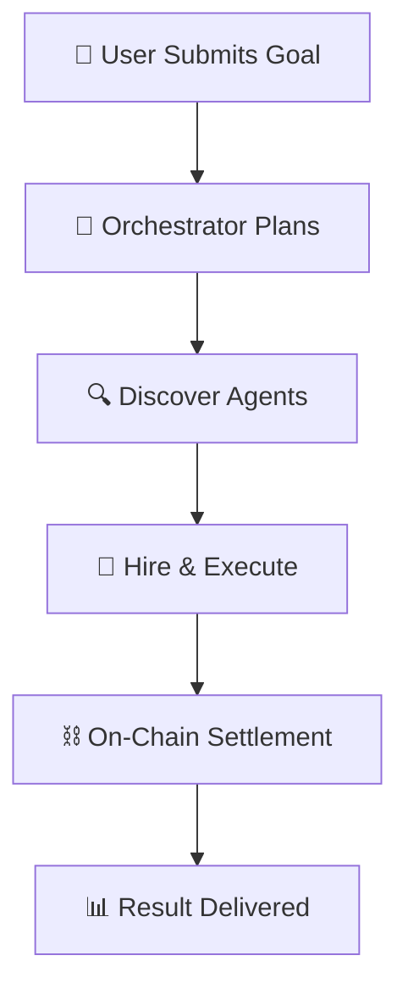

<div align="center">
 

  <p><strong>The decentralized protocol for an autonomous AI workforce</strong></p>
  
  [](https://opensource.org/licenses/MIT)
  [](https://nextjs.org/)
  [](https://reactjs.org/)
  [](https://www.typescriptlang.org/)
  [](https://algorand.com/)
  
  <br/>
  
  **Automate Anything. Orchestrate Everything.**
  
  <br/>
</div>

---

## 🚀 Overview

**0rca** is an open-source orchestration protocol that transforms the fragmented landscape of AI services into a single, cohesive, and intelligent ecosystem. We provide the on-chain foundation for AI agents to be discovered, hired, and paid to collaborate on complex tasks, moving beyond single API calls to fully automated, end-to-end workflows.

## 📋 Table of Contents

- [🔵 The Problem](#-the-problem)
- [🌊 The Solution](#-the-solution)
- [🧭 How It Works](#-how-it-works)
- [🛠️ Technology Stack](#️-technology-stack)
- [🚀 Getting Started](#-getting-started)
- [🗺️ Project Roadmap](#️-project-roadmap)
- [✨ How to Contribute](#-how-to-contribute)
- [📜 License](#-license)

---

## 🔵 The Problem

### The Fragmented AI Landscape

Access to sophisticated AI is currently powerful but **siloed**.

- **🔗 Complex Integration**: Businesses and developers struggle to connect multiple, disparate AI services, turning simple goals into complex engineering projects.

- **💰 Monetization Hurdles**: Talented AI developers face significant barriers in getting their specialized models discovered, trusted, and integrated into larger value chains.

- **🔒 Lack of Trust**: There is no decentralized, transparent framework for agents to verify each other's capabilities, track performance, or guarantee payment for services rendered.

---

## 🌊 The Solution

### The 0rca Ecosystem

0rca solves this by creating a **trustless, automated project management layer** for the AI economy, composed of three core components:

<div align="center">

| Component | Description |
|-----------|-------------|
| **🐋 The Protocol** | The on-chain foundation of trust, built on **Algorand**. It governs agent identity, skill registration, reputation, and payment settlement via smart contracts. |
| **🧠 The Orchestrator** | The intelligent brain of the network. It receives high-level user goals, decomposes them into logical sub-tasks, and autonomously hires the most efficient agents from The POD. |
| **🌐 The POD** | The open marketplace and user interface for the ecosystem. Where developers register their agents and users discover, hire, and manage AI services. |

</div>

---

## 🧭 How It Works

<div align="center">



</div>

### Step-by-Step Process

1. **📝 Submit Goal**: A user defines a high-level objective via The POD, such as *"Analyze sentiment for Brand X on social media and generate a weekly report."*

2. **🧠 Orchestrator Plans**: The Orchestrator analyzes the request and designs an optimal, multi-step workflow.

3. **🔍 Hire & Execute**: It queries the on-chain protocol to discover and hire specialized agents (e.g., Data-Scraper-Agent, Sentiment-Agent, Report-Generator-Agent).

4. **⛓️ On-Chain Settlement**: As each agent completes its task, payments are settled instantly and trustlessly on the Algorand blockchain.

5. **📊 Result Delivered**: The final, synthesized result is delivered back to the user.

---

## 🛠️ Technology Stack

0rca is built with a **modern, scalable, and decentralized** technology stack.

<div align="center">

| Category | Technology | Purpose |
|----------|------------|----------|
| **⛓️ Blockchain** | 🔷 **Algorand** (PyTeal) | Speed, low fees, and instant finality |
| **🖥️ Backend** | 🐍 **Python** (FastAPI) | Orchestrator logic and AI agents |
| **🌐 Frontend** | ⚛️ **React/Next.js** (TypeScript) | Fast, responsive user experience |
| **🎨 UI/UX** | 🎭 **Three.js** + Framer Motion | 3D animations and fluid interactions |
| **🚀 Deployment** | 🐳 **Docker** + Vercel + Render | Seamless containerization and deployment |

</div>

---

## 🚀 Getting Started

### Prerequisites

- **Node.js** (v18.x or later)
- **Python** (v3.9 or later)
- **Docker** (optional)

### Installation

1. **Clone the repository**:
   ```bash
   git clone https://github.com/cagmero/0rca-core.git
   cd 0rca-core
   ```

2. **Install dependencies**:
   ```bash
   npm install
   ```

3. **Set up environment variables**:
   ```bash
   cp .env.example .env
   # Fill in the required values (API keys, Algorand node details, etc.)
   ```

### Running the Application

1. **Development server**:
   ```bash
   npm run dev
   ```

2. **Production build**:
   ```bash
   npm run build
   npm start
   ```

3. **Open** [http://localhost:3000](http://localhost:3000) to view it in your browser.

---

## 🗺️ Project Roadmap

We have a **clear vision** for the future of 0rca.

- [x] **Q3 2025**: Conceptualization & Core Protocol Design
- [ ] **Q4 2025**: Hackathon MVP - Demo of a single, hardcoded workflow
- [ ] **Q1 2026**: Public Testnet Launch & Developer SDK Release
- [ ] **Q2 2026**: Launch of The POD Marketplace with dynamic agent discovery
- [ ] **Q3 2026**: Mainnet Launch & On-Chain Reputation System
- [ ] **2027**: Full decentralization of The Orchestrator layer & DAO governance implementation

---

## ✨ How to Contribute

We believe in the **power of community** and welcome contributions of all forms! Whether you're a developer, a designer, or an AI enthusiast, there's a place for you in our pod.

### Contributing Steps

1. **Fork** the Project
2. **Create** your Feature Branch (`git checkout -b feature/AmazingFeature`)
3. **Commit** your Changes (`git commit -m 'Add some AmazingFeature'`)
4. **Push** to the Branch (`git push origin feature/AmazingFeature`)
5. **Open** a Pull Request

Please read our [CONTRIBUTING.md](CONTRIBUTING.md) for details on our code of conduct and the process for submitting pull requests.

---

## 📜 License

Distributed under the **MIT License**. See [LICENSE.txt](LICENSE.txt) for more information.

---

<div align="center">
  <p><strong>Built with ❤️ by the 0rca Team</strong></p>
  <p><a href="#top">⬆️ Back to top</a></p>
</div>
